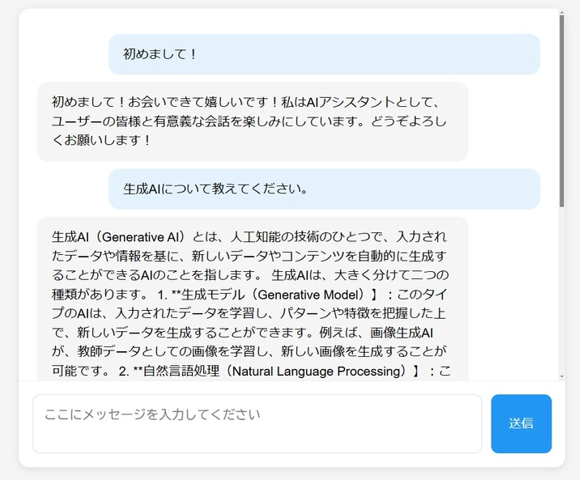

# Japanese LLM Chatbot with ELYZA Llama 3

Node.js（フロントエンド）とPython（バックエンド）を使用した日本語LLMチャットボットアプリケーションです。Ollama上で[ELYZA Llama-3-JP-8B](https://huggingface.co/elyza/Llama-3-ELYZA-JP-8B-GGUF)を利用しています。

シンプルなUIで、メッセージを入力して送信ボタンまたはENTERを押すとメッセージが送信されます。


## ⚠️ 重要な注意事項

- このアプリケーションは教育・研究目的で作成されています
- [Meta Llama 3 Community License](https://www.llama.com/llama3/license/)に従って使用してください
- このREADMEは、Windowsユーザー向けに記載しています。MacやLinuxをご使用の場合は、それぞれのOSに合わせたアプリケーションを選択してください
- コマンドはWindows PowerShellまたはターミナルで実行してください

## システム要件

### 推奨スペック
- メモリ: 16GB以上
- ストレージ: 十分な空き容量（モデルファイルに約5GB必要）
- OS: Windows 10/11
- CPU/GPU: OllamaでLLMを快適に動作させるための比較的新しいCPUまたはGPU

### 必要なソフトウェア
- Node.js v20.18.0以上
- Python 3.11以上
- Ollama

## リポジトリのファイル構成

- `server.js` - Node.jsサーバー（フロントエンド API）
- `app.py` - Pythonバックエンド（LLMとの対話処理）
- `public/index.html` - チャットUIのメインページ
- `public/style.css` - UIスタイリング
- `requirements.txt` - Pythonパッケージの依存関係
- `package.json` - Node.jsパッケージの依存関係
- `Llama-3-ELYZA-JP-8B-q4_k_m.gguf` - ELYZAの言語モデルファイル（要ダウンロード）
- `Modelfile` - 言語モデルの設定ファイル

## 環境構築ガイド

### 1. Node.jsのインストール
1. [Node.jsの公式サイト](https://nodejs.org/)にアクセス
2. v20.18.0 LTSバージョンをダウンロード
3. インストーラーを実行し、デフォルト設定でインストール
4. インストールの確認：
```bash
node --version 
npm --version
```

### 2. Pythonのインストール
1. [Python公式サイト](https://www.python.org/downloads/)から最新版をダウンロード
2. インストーラーを実行
   - 「Add Python to PATH」にチェックを入れる
   - 「Install for all users」を選択
3. インストールの確認：
```bash
python --version 
pip --version
```

### 3. Gitのインストール
1. [Git for Windows](https://gitforwindows.org/)からダウンロード
2. インストーラーを実行（デフォルト設定推奨）
3. インストールの確認：
```bash
git --version
```

### 4. Ollamaのインストール
1. [Ollama公式サイト](https://ollama.ai/download)からWindowsバージョンをダウンロード
2. インストーラーを実行
3. インストールの確認：
```bash
ollama --version
```

### 5. プロジェクトのセットアップ

1. リポジトリのクローン：
```bash
git clone https://github.com/MO-HU-P/elyza-node-chat.git
cd elyza-node-chat
```

2. ELYZAモデルのダウンロードと配置：
- [ELYZA Llama-3-JP-8B-GGUF](https://huggingface.co/elyza/Llama-3-ELYZA-JP-8B-GGUF/tree/main)から`Llama-3-ELYZA-JP-8B-q4_k_m.gguf`をダウンロード
- ダウンロードしたモデルファイル（約5GB）をプロジェクトのルートディレクトリに配置
- 以下のコマンドを実行してollamaのモデルを作成：
```bash
ollama create elyza:jp8b -f Modelfile
```
- モデルのインストールを確認：
```bash
ollama list
```

3. Node.js依存パッケージのインストール：
```bash
npm install
```

4. Python依存パッケージのインストール：
```bash
pip install -r requirements.txt
```

## アプリケーションの起動方法

**3つの異なるターミナルウィンドウで以下のコマンドを実行します**：

### 1. Ollamaサーバーの起動
```bash
ollama run elyza:jp8b
```

### 2. Pythonバックエンドの起動
新しいターミナルを開く
```bash
python app.py
```
終了する場合はCTRL+C

### 3. Node.jsフロントエンドの起動
新しいターミナルを開く
```bash
npm run dev
```
終了する場合はCTRL+C

### 4. アプリケーションへのアクセス
ブラウザで以下のURLにアクセス：
```
http://localhost:3000
```


## セキュリティ注意事項

本番環境で使用する場合は、以下の設定を推奨します：
- CORSの適切な設定
- レート制限の実装
- 適切な認証の追加
- エラーメッセージの制限

## ライセンス

このプロジェクトはMITライセンスの下で公開されています。

ただし、使用するモデル（ELYZA Llama-3-JP-8B）は[Meta Llama 3 Community License](https://www.llama.com/llama3/license/)の下で提供されています。モデルの使用に関しては、このライセンスに従ってください。
